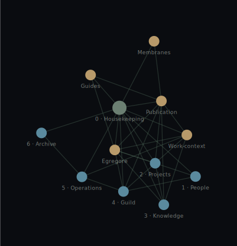

# Mapmakers Knowledgebase

<p align="center">
  
</p>

Wordmark: **nodeless graph as the “p”** ([`mapmakers-wordmark.svg`](assets/readme-brand/mapmakers-wordmark.svg) · compact [`mapmakers-wordmark-compact.svg`](assets/readme-brand/mapmakers-wordmark-compact.svg)). Edit strokes in place; swap `font-family` in the SVG if you adopt a licensed display face later.

**Start here:** [0 - Housekeeping/NAV.md](0%20-%20Housekeeping/NAV.md) — full map and table of contents.

This repository is the **Mapmakers shared knowledge base** (Zettel-style **0–6** areas: Housekeeping, People, Projects, Knowledge, Guild, **Operations**, **Archive**). No other files on repo root.

**Numbered “rooms”** (same idea as an index set — these are **real** TeX renders, stored as SVG in-repo so they show in the IDE, on mobile, and on GitHub):

<p align="center">
  
</p>

---

## Geometric map (precompiled on `main`)

Each push to **`main`** runs [`kb-graph.yml`](.github/workflows/kb-graph.yml): **d3-force** layout → committed **SVG** + self-contained **HTML** (CSS stagger: nodes in rough **git-chronology** for areas `0–6`, then satellites; edges draw after). No Mermaid — this is a real pre-rendered layout you can ship.

**Snapshot** (static; shows in the README everywhere):

<p align="center">
  
</p>

**Animated (chronological reveal)**  
GitHub **does not allow `<iframe>` in READMEs** (sanitized HTML — no embedded live apps). For real interactivity, use a **hosted** page:

- **Live site (GitHub Pages):** [mapmakers-tech-guild.github.io/Mapmakers-Knowledgebase](https://mapmakers-tech-guild.github.io/Mapmakers-Knowledgebase/) — static build from [`pages.yml`](.github/workflows/pages.yml) on every push to `main` (or run **Actions → Deploy Pages (interactive map) → Run workflow**). **One-time (after the repo is public):** in this repository go to **Settings → Pages** → under **Build and deployment** set **Source** to **GitHub Actions** and save — then re-run the workflow or push to `main` so the first deploy completes. *Do not put secrets* in the built map or committed assets; the **site is world-readable** like any public URL. *If the repo is ever private on GitHub Free again,* [Pages for private repos](https://docs.github.com/en/pages/getting-started-with-github-pages/about-github-pages#who-can-use-this-feature) requires a paid plan — otherwise disable `pages.yml` or host the `_site` output elsewhere.  
- **From a clone:** open [`assets/kb-graph/kb-graph-animated.html`](assets/kb-graph/kb-graph-animated.html) locally. Build metadata: [`assets/kb-graph/kb-graph.json`](assets/kb-graph/kb-graph.json).

**Hack locally:** `npm ci` then set `CHRONO=git` and run `npm run build:graph` (e.g. bash: `CHRONO=git npm run build:graph` · PowerShell: `$env:CHRONO='git'; npm run build:graph`). Source: [`scripts/build-kb-graph.mjs`](scripts/build-kb-graph.mjs). Optional [**vis-network** playground](kb-graph.html) at repo root for draggable tuning.

---

## Fancy math (actually rendered)

` ```math ` blocks only draw on **github.com**; your editor preview often shows **raw LaTeX**.  
So: the good stuff below is **[CodeCogs](https://www.codecogs.com/latex/eqneditor.php) → SVG**, committed under [`assets/readme-math/`](assets/readme-math/) — **vector math, not Unicode hacks.**

**Shannon entropy** — how “surprising” a distribution of topics is. Low: everything piles in one bucket. High: mass is spread (fine if the **graph still closes**).

<p align="center">
  
</p>

**Cauchy–Schwarz** — inner products don’t outrun the norms.

<p align="center">
  
</p>

**Euler (planar graph)** — Vertices, edges, faces: **V, E, F** (count the outer face too). A silly reason to like **link closure**: your drawn map of notes ought to be **embeddable** if you want classical planar invariants to line up.

<p align="center">
  
</p>

*Optional vibecheck:* ship a **closed bundle** of notes or pay the **boundary** cost on export — same energy as keeping **V − E + F** honest for the face-count you’re actually publishing.

<details>
<summary>LaTeX source (for copy-paste; renders on <strong>github.com</strong> with MathJax)</summary>

```math
H(X) = - \sum_{i} p_i \log p_i
```

```math
\bigg( \sum_{k=1}^{n} a_k b_k \bigg)^{\!2} \;\le\; \Big( \sum_{k=1}^{n} a_k^2 \Big) \Big( \sum_{k=1}^{n} b_k^2 \Big)
```

```math
V - E + F = 2
```

[Writing mathematical expressions](https://docs.github.com/en/get-started/writing-on-github/working-with-advanced-formatting/writing-mathematical-expressions) · MathJax

</details>

---

*Courtesy of the ARX Foundation* — the maintainer’s non-profit; it holds the IP for work contributed here.
