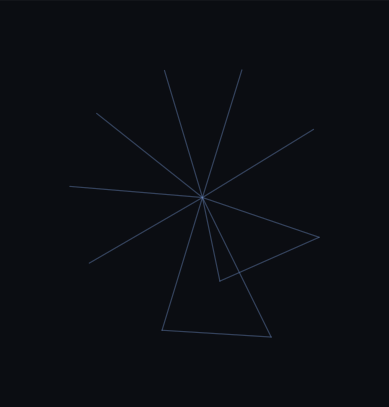

# The Meridian

  
   
  

This repo is a **shared map**: a knowledge garden at the edge of a knowledge forest. We call it **The Meridian** because we all need a point of reference — the line we return to after we wander.

If you want to build with us, you’re welcome here.

- **Onboarding**: [`ONBOARDING.md`](ONBOARDING.md)
- **Navigation**: [`0 - Housekeeping/NAV.md`](0%20-%20Housekeeping/NAV.md)
- **How we collaborate**: [`CONTRIBUTING.md`](CONTRIBUTING.md)
- **License (AFPP)**: [`LICENSE.md`](LICENSE.md)
- **MOU + CLAs**: [`LEGAL/`](LEGAL/)

Contact: `themeridian@hopefullyabysmal.com` (put “Meridian” in the subject).
